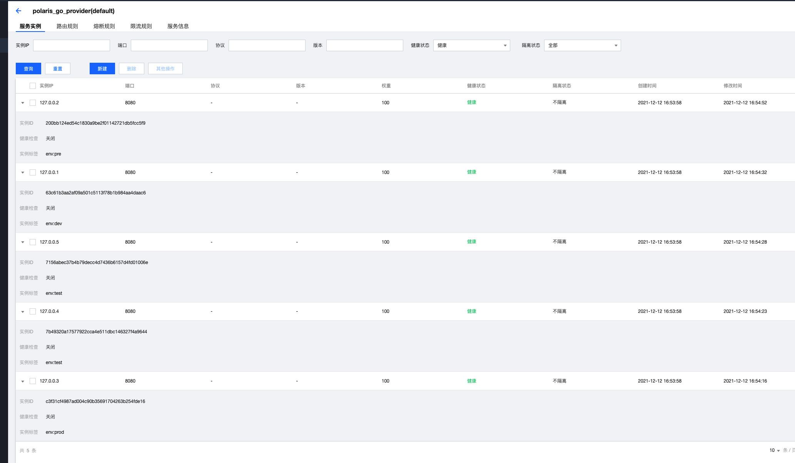

# Polaris Go

[English Document](./README.md)

## 北极星使用服务路由功能

北极星支持根据请求标签、实例标签和标签匹配规则，对线上流量进行动态调度，可以应用于按地域就近、单元化隔离和金丝雀发布等多种场景。

## 如何构建

直接依赖go mod进行构建

- linux/mac构建命令
```
go build -o route
```
- windows构建命令
```
go build -o route.exe
```

## 如何使用

### 创建服务

预先通过北极星控制台创建对应的服务，如果是通过本地一键安装包的方式安装，直接在浏览器通过127.0.0.1:8091打开控制台


### 创建路由规则


### 创建服务实例



### 修改配置

指定北极星服务端地址，需编辑polaris.yaml文件，填入服务端地址

```
global:
  serverConnector:
    addresses:
    - 127.0.0.1:8091
```

### 执行程序

直接执行生成的可执行程序

- linux/mac运行命令
```
./route --service="provider service name" --namespace="provider namespace name" --selfService="consumer service name" --selfNamespace="consumer namespace name"
```

- windows运行命令
```
./route.exe --service="provider service name" --namespace="provider namespace name" --selfService="consumer service name" --selfNamespace="consumer namespace name"
```

### 期望结果

运行后，最终会打印具有标签`env=test`的服务实例

```
➜  route git:(feat_demo) ✗ ./route --service="polaris_go_provider"
2021/12/12 16:58:34 start to invoke GetInstancesRequest operation
2021/12/12 16:58:34 instance GetInstances 0 is 127.0.0.5:8080 metadata=>map[string]string{"env":"test", "protocol":"", "version":""}
2021/12/12 16:58:34 instance GetInstances 1 is 127.0.0.4:8080 metadata=>map[string]string{"env":"test", "protocol":"", "version":""}
```